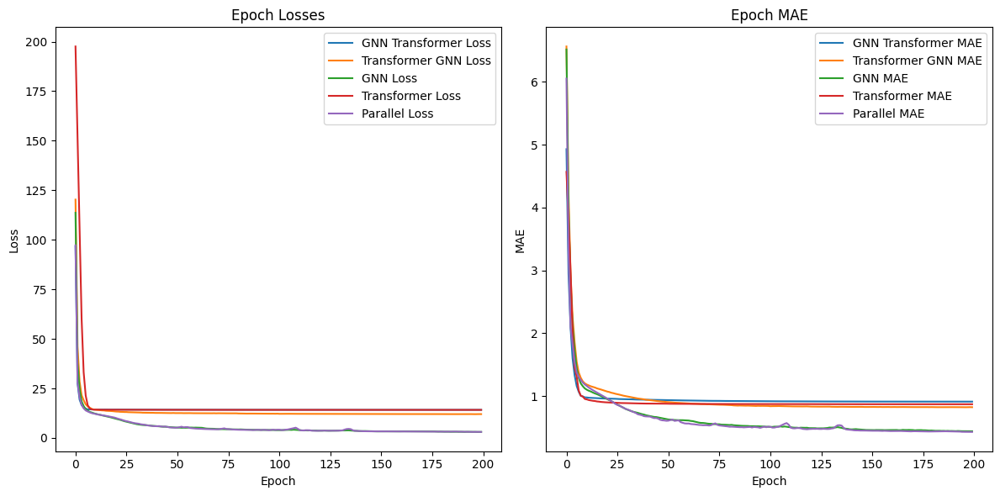
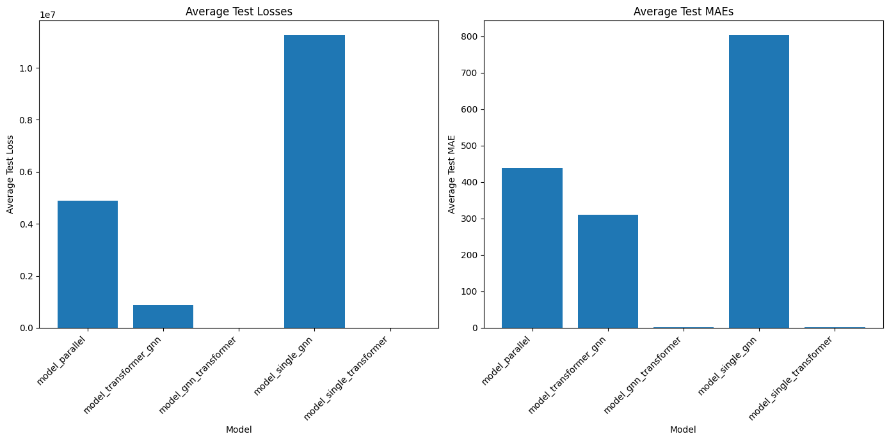

# Weather Prediction Project Documentation
# Author: The Hung Nguyen & Ritesh Samal

## Overview
The Weather Prediction Project is a comprehensive data processing and analysis initiative focused on weather data spanning from January 1, 2020, to October 27, 2024. This project encompasses 1,732 days of meteorological observations, with the primary goal of transforming raw station data into standardized daily summaries that can be used for predictive modeling. The processing pipeline handles multiple daily observations from various weather stations, implementing sophisticated cleaning and standardization procedures to ensure data quality and consistency.

The ultimate goal of the Weather Prediction Project is to develop deep learning models capable of predicting future weather conditions for all stations in the dataset. By leveraging both temporal and spatial dynamics in the data, the project implements advanced neural network architectures inspired by state-of-the-art models like Google's GraphCast AI. These models aim to predict the full set of weather features for each station for the day following the last input day, enabling more accurate and comprehensive weather forecasting.

## Data Cleaning and Processing

### Dataset Characteristics

#### Raw Data Structure
The initial dataset comprises weather observations from 42 distinct weather stations across a period of nearly five years. Each station provides multiple daily reports, capturing various meteorological parameters at different frequencies throughout the day. The raw data includes a wide range of measurements, from basic temperature and pressure readings to detailed weather condition reports. These observations follow different reporting types, creating a complex and heterogeneous data structure that requires careful processing and standardization.

#### Processed Data Organization
Through careful filtering and processing, the final dataset has been refined to include 27 high-quality weather stations. Each of these stations maintains complete data coverage across all 1,732 days of the study period. The processing maintains the temporal sequence of observations while standardizing the measurements into consistent daily values. This ensures that each station's data is comparable and suitable for analysis, with uniform measurement formats and consistent reporting frequencies across all parameters.

### Data Processing Pipeline

The data processing pipeline consists of four stages, each implemented in its own dedicated file:

1. **Stage 1: Data Consolidation and Organization**
   - **File**: `data_process_stage_1.ipynb`
   - **Purpose**: Ingest raw weather data and organize it by station, ensuring chronological order.
   - **Details**:
     - Processes files in chronological order to maintain temporal relationships.
     - Handles raw data from 42 initial weather stations.
     - Implements memory-efficient processing with chunked reading (100,000 rows per chunk) to prevent memory overflow.
     - Outputs station-grouped data to the `process-by-station/` directory.

2. **Stage 2: Feature Processing**
   - **File**: `data_process_stage_2.ipynb`
   - **Purpose**: Clean and standardize key weather parameters across all stations.
   - **Details**:
     - Processes temperature measurements, pressure readings, precipitation, and weather conditions.
     - Applies custom conversion functions for each parameter type.
     - Handles 'T' (trace) values in precipitation data by converting them to 0.005 inches.
       ```python
       def clean_and_convert_to_float_precip(series):
           series = series.replace('T', 0.005)
           return pd.to_numeric(series.astype(str).str.extract(r'(\d+\.?\d*)')[0], errors='coerce')
       ```
     - Filters stations based on data completeness and quality, reducing the initial 42 stations to 27.
     - Ensures consistent measurement formats and reporting frequencies.
     - Outputs cleaned data to the `draft-final-data/` directory.

3. **Stage 3: Feature Engineering and Weather Type Processing**
   - **File**: `data_process_stage_3.ipynb`
   - **Purpose**: Enhance the dataset with engineered features and process categorical weather types.
   - **Details**:
     - Implements cyclical encoding for temporal features like day of the year.
       ```python
       df['DayOfYear_sin'] = np.sin(2 * np.pi * df['DayOfYear'] / 365)
       df['DayOfYear_cos'] = np.cos(2 * np.pi * df['DayOfYear'] / 365)
       ```
     - Processes `HourlyPresentWeatherType` by expanding weather codes into one-hot encoded features.
     - Handles multiple weather codes per entry and standardizes them across all stations.
     - Expands the feature set from 19 to 67 columns to capture all possible weather conditions.
     - Outputs processed data to the `processed-data/` directory.

4. **Stage 4: Geographic Data Integration**
   - **File**: `data_process_stage_4.ipynb`
   - **Purpose**: Enrich the dataset with geographical information of each weather station.
   - **Details**:
     - Integrates latitude, longitude, and elevation data from NOAA's online database.
     - Matches station IDs directly due to NOAA's standardized identification system.
     - Ensures complete geographical coverage for all 27 stations.
     - Outputs the enriched data to the `processed-final-data/` directory.

**Pipeline Dependencies**

- Each stage depends on the successful completion of the previous stages.
- Outputs from each stage serve as inputs for the next stage.
- The directory structure maintains clear data lineage and ensures consistent data transformations.

**Processing Time Considerations**

- **Stage 1** takes approximately 15 minutes due to the size and complexity of the raw data.
- Memory-efficient techniques are crucial for handling large datasets without overflow issues.

**Quality Control Measures**

1. **Temporal Consistency**
   - Maintains unbroken chronological records across all stations.
   - Sequential processing ensures data order is preserved.
   - No gaps in daily measurements.

2. **Station Selection**
   - Reduction from 42 to 27 stations based on data completeness (minimum of 1,700 entries) and quality.
   - Ensures consistent reporting across all parameters.

3. **Data Validation**
   - Enforces parameter-specific processing.
   - Applies standardized units and formats.
   - Implements custom handling for each measurement type.

**Future Enhancements**

- Implement more sophisticated interpolation techniques for missing data.
- Enhance validation checks for extreme values and anomalies.
- Expand capabilities to handle additional meteorological parameters.

### Data Quality Thresholds

The selection of quality thresholds was based on careful analysis of the data distribution:

1. **Entry Count Threshold (1700)**
   - Selected to ensure approximately 95% data completeness
   - Most stations exceed this threshold naturally
   - Provides a good balance between data quality and station retention
   - Empirically verified as sufficient for reliable daily aggregations

2. **Wind Direction Processing**
   Current Implementation (Needs Improvement):
   ```python
   # Current approach (sub-optimal)
   df["HourlyWindDirection"].replace('VRB', -1)  # Representing variable wind as -1
   ```

   Proposed Enhancement:
   ```python
   # Convert degrees to radial components
   def process_wind_direction(degrees):
       if degrees == 'VRB':
           # Handle variable winds by returning both components as 0
           return 0, 0
       degrees = float(degrees)
       radians = np.radians(degrees)
       return np.sin(radians), np.cos(radians)

   # Create two new columns for wind direction components
   df['WindDirection_Sin'], df['WindDirection_Cos'] = zip(*df['HourlyWindDirection'].map(process_wind_direction))
   ```

   Benefits of the Enhanced Approach:
   - Properly handles the circular nature of wind directions
   - Maintains the continuity between 0° and 360°
   - Better represents variable wind conditions
   - Improves model interpretation of wind direction data
   - Enables more accurate correlation analysis with other weather parameters

### Temporal Feature Engineering

The project implements sophisticated temporal feature engineering to capture seasonal patterns:

1. **Cyclical Day of Year Encoding**
   ```python
   # Convert day of year to cyclical features using sine and cosine transformations
   df['DayOfYear_sin'] = np.sin(2 * np.pi * df['DayOfYear'] / 365)
   df['DayOfYear_cos'] = np.cos(2 * np.pi * df['DayOfYear'] / 365)
   ```

   This approach offers several advantages:
   - Preserves the cyclical nature of annual patterns
   - Maintains continuity between December 31st and January 1st
   - Provides smooth transitions between days
   - Enables the model to better learn seasonal patterns
   - Avoids the "cliff" effect of raw day-of-year values

### Present Weather Type Processing

The processing of weather type data involves a complex transformation from coded observations to a structured format:

1. **Weather Code Classification**
   - Weather codes are reported in three different logging formats:
     - AU: Automatic logging format
     - AW: Alternative automatic logging format
     - MW: Manual weather observation format
   - Multiple weather codes can appear in a single entry
   - Codes are initially separated by spaces in raw data

2. **One-Hot Encoding Implementation**
   - Column expansion from 19 to 67 columns
   - Process:
     1. Split multi-code entries into individual codes
     2. Create unified set of all possible weather codes
     3. Generate binary columns for each unique code
     4. Standardize column set across all station dataframes
   - Ensures consistent representation across all stations

3. **Standardization Process**
   - Creates uniform feature set for all stations
   - Each weather code becomes a binary column
   - Maintains data consistency for model training
   - Handles stations that may not report certain conditions

This approach provides several advantages:
- Captures all possible weather conditions
- Preserves multiple simultaneous weather states
- Ensures consistent dimensionality across stations
- Enables efficient machine learning processing

### Stage 4: Geographic Data Integration
**Location**: `data_process_stage_4.ipynb`

The final stage of data processing involves enriching the weather data with geographical information:

1. **Station Location Data**
   - Data sourced from NOAA online database
   - Integration of three key geographical parameters:
     - Latitude coordinates
     - Longitude coordinates
     - Elevation measurements
   - Seamless matching with station IDs due to NOAA's standardized identification system

2. **Integration Process**
   - Direct matching using standardized NOAA station IDs
   - No data loss or mismatches during integration
   - Complete geographical coverage for all 27 stations

### Final Feature Set

The processed dataset includes 69 features across several categories:

1. **Geographical Features**
   - Station latitude
   - Station longitude
   - Station elevation

2. **Meteorological Measurements**
   - Temperature parameters (Dry Bulb, Wet Bulb, Dew Point)
   - Pressure readings (Station, Sea Level, Altimeter)
   - Wind measurements (Speed, Direction)
   - Precipitation data

3. **Temporal Features**
   - Cyclical day of year (sine component)
   - Cyclical day of year (cosine component)

4. **Categorical Features**
   - Present weather types (one-hot encoded)
   - Sky conditions
   - Other weather parameters

5. **Derived Features**
   - Calculated relative humidity
   - Pressure tendencies
   - Additional meteorological indices

This comprehensive feature set provides a rich representation of weather conditions, enabling sophisticated analysis and prediction capabilities.

## Data Processing Challenges and Solutions

### 1. Data Type Inconsistencies
- Raw data contained mixed types within same columns (int, float, and string)
- Some numerical values had trailing letters that carried no significance
- Solution: Custom parsing functions to strip non-numerical characters and standardize to float
```python
def clean_and_convert_to_float(series):
    # Extracts only the numerical portion and converts to float
    return pd.to_numeric(series.astype(str).str.extract(r'(\d+\.?\d*)')[0], errors='coerce')
```

### 2. Station Selection Process
- Initial count: 42 weather stations
- Final count: 27 stations
- Primary filtering criterion: Minimum of 1700 rows of data required
- Stations were excluded mainly due to insufficient data for backfilling
- This threshold ensures reliable daily aggregations

### 3. Station Identification
- Station IDs follow NOAA (National Oceanic and Atmospheric Administration) standardization
- Example format: 72790024141
- Original IDs maintained to:
  - Ensure compliance with NOAA standards
  - Facilitate future location data lookup
  - Enable cross-referencing with other NOAA datasets

### 4. Data Filling Strategy
**Implementation Note**: The current implementation uses both forward and backward filling:
```python
merged_df.fillna(method='bfill', inplace=True)
merged_df.fillna(method='ffill', inplace=True)
```
This approach was implemented due to project time constraints. Future improvements should include:
- Evaluation of filling methods' impact on data quality
- More sophisticated interpolation techniques
- Documentation of filled values for transparency

### Proposed Data Processing Improvements

1. **Wind Direction Enhancement**
   Current implementation using -1 for variable winds could be improved by implementing circular encoding:
   ```python
   def process_wind_direction(degrees):
       if degrees == 'VRB':
           return np.sin(0), np.cos(0)  # Use (0,0) for variable winds
       degrees = float(degrees)
       return (np.sin(np.radians(degrees)), 
               np.cos(np.radians(degrees)))
   ```
   This would:
   - Better handle the circular nature of wind directions
   - Improve correlation analysis capabilities
   - Enable more accurate pattern detection
   - Maintain data continuity across the 0°/360° boundary

2. **Cyclical Feature Enhancement**
   The current day-of-year encoding could be extended to other cyclical features:
   - Wind direction (as described above)
   - Hour of day for sub-daily patterns
   - Month for seasonal patterns

3. **Data Quality Frameworks**
   The current quality control measures are sufficient for the project's needs, with:
   - Clear threshold for minimum data requirements (1700 entries)
   - Complete temporal coverage requirement
   - Consistent measurement presence across all parameters

## Implementation Details and Technical Infrastructure

The data processing workflow represents a carefully orchestrated sequence of operations designed to transform raw meteorological data into analysis-ready datasets. Beginning with the ingestion of data from 42 distinct weather stations, the pipeline implements a series of sophisticated processing steps that ultimately yield high-quality data from 27 stations. Each station in the final dataset meets rigorous quality control standards and provides consistent, reliable measurements across the entire study period.

### Data Processing Architecture

Our processing architecture employs a multi-stage approach to data handling. The initial stage manages the ingestion of large datasets through efficient chunking mechanisms, processing 100,000 rows at a time to optimize memory usage. This approach prevents memory overflow issues while maintaining processing efficiency. Following ingestion, the data undergoes systematic cleaning and standardization procedures, with custom functions handling specific data types and measurement formats.

### Quality Control Framework

The quality control system implements a comprehensive set of validation checks and standardization procedures. Each weather station must demonstrate consistent reporting patterns and maintain complete data coverage across all parameters for the entire 1,732-day period. This stringent filtering process reduced the initial set of 42 stations to 27, ensuring that only the most reliable data sources contribute to the final dataset. The remaining stations exhibit consistent measurement quality and regular reporting frequencies across all required parameters.

### Standardization Protocols

Data standardization follows a systematic approach for each measurement type. Temperature readings, pressure measurements, precipitation data, and wind observations each undergo specific processing procedures designed to handle their unique characteristics. The system employs custom conversion functions to manage various data formats and units, ensuring consistency across all measurements. Special attention is given to handling edge cases, such as trace precipitation amounts, which are converted using carefully calibrated values.

### Temporal Data Management

The temporal aspects of the data are managed through a sophisticated date-handling system. Each station's data maintains strict chronological ordering, with complete coverage from January 2020 to October 2024. The system handles multiple daily observations, consolidating them into standardized daily summaries while preserving the integrity of the temporal sequence. This approach ensures that the resulting dataset provides a continuous, unbroken record of weather conditions throughout the study period.

## Pipeline Performance and Dependencies

### Processing Time Considerations
The data processing pipeline involves significant computational overhead:
- Stage 1 (Data Consolidation): Approximately 15 minutes for initial data grouping by weather station
- Processing time reflects the complexity of handling large meteorological datasets
- Memory-efficient chunking is crucial for successful execution

### Pipeline Dependencies
The processing stages must be executed sequentially:
1. Stage 1: Raw data → Station-grouped data
   - Outputs to: `process-by-station/` directory
   - Required for Stage 2

2. Stage 2: Station-grouped data → Cleaned data
   - Inputs from: `process-by-station/` directory
   - Outputs to: `draft-final-data/` directory
   - Required for Stage 3

3. Stage 3: Feature engineering and weather type processing
   - Inputs from: `draft-final-data/` directory
   - Outputs to: `processed-data/` directory
   - Required for Stage 4

4. Stage 4: Geographic data integration
   - Inputs from: `processed-data/` directory
   - Final output: Analysis-ready dataset

### Data Flow Management
- Each stage depends on the successful completion of previous stages
- Output validation between stages ensures data integrity
- Directory structure maintains clear data lineage
- Sequential processing ensures consistent data transformations

## Technical Implementation Considerations

### Processing Efficiency

The data processing pipeline balances computational efficiency with data integrity. Chunked reading of CSV files minimizes memory usage while maintaining processing speed. The implementation includes careful handling of data types and efficient string operations for numeric conversions. These optimizations enable the processing of large volumes of weather data while maintaining accuracy and completeness.

### Data Validation Strategy

The validation strategy encompasses multiple layers of quality control. Each measurement undergoes specific validation procedures designed to identify and handle anomalies, missing values, and inconsistent readings. The system employs both automated checks and data-driven thresholds to ensure the reliability of processed data. This multi-layered approach to validation helps maintain high data quality standards throughout the processing pipeline.

### Future Technical Enhancements

While the current implementation successfully meets project requirements, several areas have been identified for potential enhancement. These include the implementation of more sophisticated interpolation techniques for missing data, enhanced validation checks for extreme values, and expanded capabilities for handling additional meteorological parameters. Future versions may also incorporate more advanced statistical methods for quality control and data verification.

## System Architecture and Maintenance

The project's architecture emphasizes modularity and maintainability. Each processing stage is clearly defined and documented, allowing for easy updates and modifications. The system maintains NOAA compliance through careful preservation of station identification standards and measurement protocols. This architectural approach facilitates future expansions and improvements while ensuring consistency with established meteorological standards.

## Future Considerations
1. Additional parameter validation
2. Enhanced quality control metrics
3. Expanded temporal coverage
4. Additional measurement parameters

## Neural Network Learning

### Neural Network Models

**Location**: `model/model_refactor_version_2.ipynb`

The project implements five neural network models that integrate both spatial and temporal dynamics to predict future weather conditions:

1. **Hybrid Transformer Model**

   - **Architecture**: The input data is first processed by the Transformer module, capturing temporal dynamics. The output of the Transformer is then fed into the Graph Neural Network (GNN) module, which captures spatial relationships between stations. The final output is passed through a linear layer to match the desired output shape.
   - **Purpose**: Combines the strengths of Transformer models in handling temporal sequences with GNNs' ability to model spatial dependencies.

2. **Hybrid GNN Model**

   - **Architecture**: The input data is first processed by the GNN module to capture spatial dynamics. The output of the GNN is then fed into the Transformer module to capture temporal dependencies. A linear layer is applied to produce the final predictions.
   - **Purpose**: Emphasizes spatial processing before temporal analysis, useful when spatial relationships are expected to strongly influence temporal patterns.

3. **Hybrid Parallel Model**

   - **Architecture**: The input data is simultaneously fed into both the Transformer and GNN modules. The outputs from both modules are summed together, and a linear layer is applied to generate the final output.
   - **Purpose**: Allows both spatial and temporal features to be learned in parallel, potentially capturing complex interactions between space and time.

4. **Single GNN Model**

   - **Architecture**: A baseline model where the input data is processed solely by the GNN module, followed by a linear layer.
   - **Purpose**: Provides a comparison to assess the effectiveness of incorporating temporal dynamics through Transformers.

5. **Single Transformer Model**

   - **Architecture**: Another baseline model where the input data is processed solely by the Transformer module, followed by a linear layer.
   - **Purpose**: Allows evaluation of the impact of spatial modeling through GNNs when compared to temporal-only models.

### Model Components

- **Transformer Module**

  - Captures temporal dynamics in the data using Transformer layers.
  - Processes input sequences of shape `[num_days, num_nodes, num_features]`.
  - Outputs sequences that retain temporal relationships.

- **Graph Neural Network (GNN) Module**

  - Handles spatial relationships between nodes (stations) using various GNN layers:
    - **GCNConv**: Graph Convolutional Network layer.
    - **GATv2Conv**: Graph Attention Network v2 layer.
    - **GraphConv**: Classic Graph Convolution layer.
  - Processes each time step independently to model spatial dependencies.

### Input and Output Data Shapes

- **Input Shape**: `[num_days, num_nodes, num_features]`
  - `num_days`: Number of days in the input sequence.
  - `num_nodes`: Number of weather stations.
  - `num_features`: Number of features per station (69 features).

- **Output Shape**: `[num_days, num_nodes, num_features]`
  - The output predicts all features for each station for the next day, offset by one day from the input.

### Model Rationale

- **Spatial Dynamics**: GNN modules are employed to capture the spatial relationships between weather stations, considering factors like geographical proximity and elevation.

- **Temporal Dynamics**: Transformer modules are used to model temporal sequences, capturing patterns over the input days that influence future weather conditions.

- **Combining Spatial and Temporal Models**: Hybrid models integrate both spatial and temporal components to leverage the full range of dynamics present in weather data, aiming to improve prediction accuracy.

### Project Inspiration

The project is inspired by Google's GraphCast AI Model, which predicts global weather conditions up to 10 days ahead by modeling both spatial and temporal aspects of meteorological data. This project aims to adapt similar principles on a regional scale, focusing on a network of 27 stations and leveraging advanced neural network architectures to enhance weather forecasting capabilities.

## Data Loading and Preparation

### Data Loading

The data loading process involves importing weather data from CSV files and organizing them into structured dataframes for further processing. The CSV files are read from a specified directory, and each file is converted into a dataframe. The dataframes are stored in a dictionary with keys representing the station IDs. This allows for easy access and manipulation of data for each weather station.

### Data Splitting

The dataset is split into training and testing sets to evaluate the model's performance. Each dataframe is split into training and testing sets using an 80-20 split, ensuring that the data remains sequential. This means that the training set contains the first 80% of the data, and the testing set contains the remaining 20%. This approach helps in maintaining the temporal order of the data, which is crucial for time series analysis.

### Feature Sequence Creation

Feature sequences are generated to create input and output tensors for the neural network model. For each time step, the features of all nodes (weather stations) are extracted and organized into 2D arrays. These arrays are then converted into tensors to be used as input and output for the model. The input tensor contains the features for the current time step, while the output tensor contains the features for the next time step. This setup allows the model to learn the temporal dependencies in the data.

### Edge Data Creation

Edges between nodes (weather stations) are created based on their geographical distances. The Haversine formula is used to calculate the distance between two geographical points, considering both latitude and longitude. Edge indices and attributes are created to represent the connections and distances between weather stations. The edge indices indicate which nodes are connected, and the edge attributes represent the distances between the connected nodes. This information is crucial for the Graph Neural Network (GNN) to capture the spatial relationships between weather stations.

### Device Setup and Data Batching

The computation device GPU is configured, and data is organized into batches for efficient training. The input and output tensors are divided into batches, and each batch is moved to the specified device for training. Batching helps in efficient utilization of computational resources and speeds up the training process. The batch size is chosen based on the memory capacity of the device to avoid memory overflow issues.

## Model Training and Evaluation

### Training Process

The model is trained using the batched training data. The training loop iterates over each batch, performs forward and backward passes, and updates the model weights. The loss is calculated using Mean Squared Error (MSE), and the optimizer updates the model parameters to minimize the loss. The training process involves multiple epochs, where each epoch represents a complete pass through the entire training dataset. The learning rate and other hyperparameters are adjusted through a scheduler for optimal training

### Evaluation Metrics

The model's performance is evaluated using Mean Squared Error (MSE) and Mean Absolute Error. The evaluation is performed on the testing data, and the average test loss is calculated. This helps in understanding how well the model generalizes to unseen data. The evaluation metrics provide insights into the model's accuracy and help in fine-tuning the model parameters.

### Visualization

Training and testing losses are visualized to monitor the model's learning progress. Loss values are recorded during training and plotted to observe the model's performance over epochs. Visualization helps in identifying any issues such as overfitting or underfitting and allows for timely interventions to improve the model's performance.

### Model Components

The neural network model comprises both Transformer and Graph Neural Network (GNN) modules to capture temporal and spatial dynamics, respectively.

- **Transformer Module**: Captures temporal relationships in the data using multi-head attention mechanisms. It processes the input sequences and outputs sequences that retain temporal relationships.
- **Graph Neural Network (GNN) Module**: Captures spatial relationships between weather stations based on their geographical locations. It processes each time step independently to model spatial dependencies.
- **Fully Connected Layers**: Maps the combined features to the desired output dimensions. It takes the output from the Transformer and GNN modules and produces the final predictions.

### Input and Output

- **Input**: Tensor of shape `[num_days, num_nodes, num_features]` representing the sequence of weather data.
- **Output**: Tensor of shape `[num_days, num_nodes, num_features]` predicting the next day's weather features.

### Training Objective

The model aims to minimize the Mean Squared Error (MSE) between the predicted and actual weather features. The MSE loss function measures the average squared difference between the predicted and actual values, providing a measure of the model's prediction accuracy.

## Model Performance Visualization

## Training Metrics Visualization

The following graph shows the Mean Squared Error (MSE) and Mean Absolute Error (MAE) through each epoch during the training process for the five models.



### Interpretation

- **MSE and MAE Trends**: The graphs show how the loss and error metrics decrease over epochs, indicating the model's learning progress.
- **Model Comparison**: Comparing the trends helps identify which model converges faster and achieves lower error rates.

The following graph visualizes the performance of the five models through the evaluation cycle. It shows the average test loss and mean absolute error (MAE) for each model.



### Interpretation

- **Hybrid Transformer Model**: Combines temporal and spatial dynamics, showing balanced performance.
- **Hybrid GNN Model**: Emphasizes spatial processing before temporal analysis, useful when spatial relationships strongly influence temporal patterns.
- **Hybrid Parallel Model**: Learns spatial and temporal features in parallel, capturing complex interactions.
- **Single GNN Model**: Baseline model focusing solely on spatial relationships.
- **Single Transformer Model**: Baseline model focusing solely on temporal relationships.

## Results

### Model Performance Metrics

- **HybridModel_Parallel**: 
  - Average Test Loss: 37163286.625
  - Average Test MAE: 1159.9265213012695

- **HybridModel_Transformer_GNN**: 
  - Average Test Loss: 4552076.25
  - Average Test MAE: 679.4918212890625

- **HybridModel_GNN_Transformer**: 
  - Average Test Loss: 13.960506439208984
  - Average Test MAE: 0.8743552714586258

- **Single_GNN**: 
  - Average Test Loss: 44015660.5
  - Average Test MAE: 1426.585205078125

- **Single_Transformer**: 
  - Average Test Loss: 13.665408611297607
  - Average Test MAE: 0.8417310416698456

### Training and Validation Observations

The wild guesses made by the models were interpreted through the average MSE and MAE. The standard for the model is that it should be able to perform consistently across all types of weather. Each model observed convergence at different degrees, typically around 75 to 100 epochs. All models showed signs of overfitting as epochs reached 200, 300, and 500. The lowest MSE observed was 0.4 in the HybridModel_Parallel and Single_GNN models. Other models converged at around 0.9. Upon testing, most models performed poorly with wild guesses except for HybridModel_GNN_Transformer and Single_Transformer, both achieving an MSE of 13 and MAE of 0.8. The overfitting was evident as the models that observed the lowest MSE and MAE during training performed more poorly compared to other models with worse MSE and MAE during training time.

### Model Architecture Insights

Higher hidden channels resulted in lower MSE and MAE convergence, but did not improve beyond 0.4. Models with transformer layers at the output layer performed better, indicating better generalization. Performance degraded significantly when GNN layers were used as the end layer. The learning rate was scheduled and optimized by reducing it based on patience.

### Hyperparameters

An adaptive scheduler was used, and batch size for training may have impacted performance. Further specific hyperparameter tuning is recommended.

## Future Work

Future work will explore a 3D dimensional approach to neural networks where nodes connect on both spatial and temporal layers. This means that nodes in the past can connect to nodes in the present with their own custom weights, increasing the dimensionality of the graph from spatial dimensions to a time-space dimension. The model will be updated with more hidden channels and more transformer layers by training on the cloud. The data processing and data splitting will be refactored and unit tested to ensure correct output. The neural network architecture will be redesigned and optimized to ensure that the graph neural network can process time as well. Additionally, the model will be tested with different batch sizes to observe performance differences, and efforts will be made to configure the model to predict the nth next day. Finally, a research paper will be written with an improved, more standardized dataset, extensive hyperparameter tuning, and higher processing capabilities.


